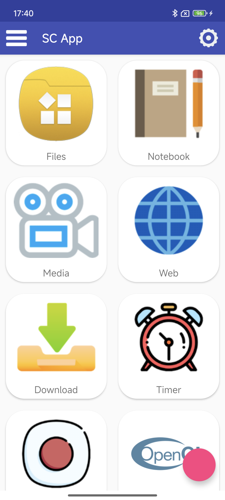

# SCApp

SCApp是我用来学习安卓app开发的项目。用kotlin语言使用最简单的方法实现安卓app的各种功能，这些功能包括：

### 主菜单

包名：com.sc.scapp

一个[material design](https://material.io/develop/android)风格的app首页

### 笔记本

包名：com.sc.notebook

使用Compose + ViewModel + Room实现可以存储文本的笔记本。

博客：[安卓实现笔记本app](https://blog.csdn.net/SSSxCCC/article/details/124041104)

### 媒体播放器

包名：com.sc.media

使用MediaProvider实现的可以播放视频和音频的播放器。

博客：[安卓实现播放器app](https://blog.csdn.net/SSSxCCC/article/details/123797565)

### 录屏/录音

包名：com.sc.recorder

使用MediaRecorder实现录屏和录音。

博客：[安卓实现录屏app](https://blog.csdn.net/SSSxCCC/article/details/119253938)

### 浏览器

包名：com.sc.web

使用Webview实现的浏览器。

博客：[安卓实现浏览器app](https://blog.csdn.net/SSSxCCC/article/details/123798922)

### 下载

包名：com.sc.download

使用AsyncTask和OkHttp实现的后台下载文件功能。

### OpenGL渲染

包名：com.sc.opengl

使用OpenGL来绘制图像。

### 设置

包名：com.sc.settings

使用Preference实现的设置功能。

## 示例

